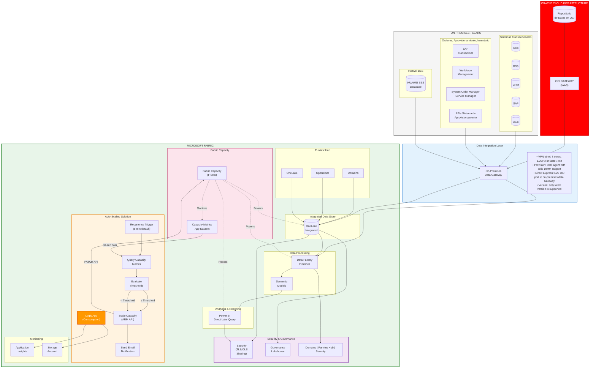

# Enhanced Architecture - Microsoft Fabric with Auto-Scaling

## Overview

This document presents a comprehensive architecture that integrates on-premises Claro systems with Microsoft Fabric, featuring automated capacity scaling for optimal performance and cost management.

## Architecture Diagram



## Architecture Components

### 1. On-Premises Systems (CLARO)

#### Sistemas Transaccionales
- **OSS** (Operations Support Systems)
- **BSS** (Business Support Systems)
- **CRM** (Customer Relationship Management)
- **SAP** (Enterprise Resource Planning)
- **OCS** (Online Charging System)

#### Order Management & Provisioning
- SAP Transactions
- Workforce Management
- System Order Manager / Service Manager
- Provisioning APIs

#### Network Infrastructure
- **Huawei BES** (Base Station Database)

### 2. Oracle Cloud Infrastructure

- **OCI Database**: Centralized data repository
- **OCI Gateway (IAAS)**: Integration endpoint for data access

### 3. Data Integration Layer

#### On-Premises Data Gateway
- **Requirements**:
  - VPN tunnel: 8 cores, 3.2GHz or faster, x64
  - Solid DIMM support for agent installation
  - Direct Express: E20 100 port connectivity
  - Latest version required
- **Function**: Secure bridge between on-premises systems and Microsoft Fabric

### 4. Microsoft Fabric Platform

#### Purview Hub (Governance & Discovery)
- **Domains**: Data domain organization
- **Operations**: Monitoring and management
- **OneLake Integration**: Unified data lake access

#### Integrated Data Store
- **OneLake**: Single, unified data lake for all Fabric workloads
- Multi-format support (Delta, Parquet, CSV, etc.)
- Automatic replication and optimization

#### Data Processing
- **Data Factory**: ETL/ELT pipelines for data ingestion and transformation
- **Semantic Models**: Business logic and metrics layer

#### Analytics & Reporting
- **Power BI**: Interactive reports and dashboards
- **Direct Lake Query**: Ultra-fast query performance directly from OneLake

#### Security & Governance
- **Security (TLS/OLS)**: Transport and object-level security, data sharing controls
- **Governance Lakehouse**: Centralized governance policies
- **Integrated Controls**: Domains, Purview Hub, Security unified management

### 5. Fabric Capacity & Auto-Scaling

#### Fabric Capacity (F SKU)
- Powers all Fabric workloads (Data Factory, OneLake, Power BI, etc.)
- Scalable from F2 to F2048 SKUs
- Pay-as-you-go or reserved capacity options

#### Capacity Metrics App
- Real-time utilization monitoring
- 30-second granularity data points
- CPU, memory, and throughput metrics

#### Auto-Scaling Solution (Logic App)
- **Trigger**: Recurrence (default: every 5 minutes)
- **Query**: Retrieves last hour of capacity metrics (30-second intervals)
- **Evaluation**:
  - Scale-up window: Last 5 minutes (configurable 1-15 min)
  - Scale-down window: Last 15 minutes (configurable 1-30 min)
  - Intelligent decision logic prevents flip-flopping
- **Scaling**: Uses Azure ARM API to adjust capacity SKU
- **Notification**: Email alerts for all scaling actions
- **Monitoring**: Application Insights and Storage Account for diagnostics

#### Auto-Scaling Decision Logic
```
IF average utilization ≥ scaleUpThreshold (default: 100%) over scaleUpMinutes
   → SCALE UP to scaleUpSku
ELSE IF average utilization ≤ scaleDownThreshold (default: 50%) over scaleDownMinutes
   → SCALE DOWN to scaleDownSku
ELSE
   → NO ACTION
```

### 6. Monitoring Infrastructure

- **Application Insights**: Logic App execution logs and performance metrics
- **Storage Account**: Diagnostic logs and workflow state
- **Capacity Metrics Dashboard**: Real-time capacity utilization visualization

## Data Flow

### Ingestion Flow
1. **Source Systems** → On-Premises Data Gateway → **Data Factory**
2. Data Factory → **OneLake** (landing/bronze layer)
3. OneLake → Data Factory (transformation) → **OneLake** (silver/gold layers)
4. OneLake → **Semantic Models** → **Power BI** (Direct Lake)

### Auto-Scaling Flow
1. **Capacity Metrics App** collects utilization data (30-second intervals)
2. **Logic App** queries metrics every 5 minutes (configurable)
3. Evaluates against thresholds using separate time windows
4. If thresholds met → **Scales capacity** via Azure ARM API
5. Sends **email notification** with scaling details
6. Logs execution to **Application Insights**

### Governance Flow
1. Data ingestion → **Purview Hub** auto-discovers assets
2. **Domains** organize data by business area
3. **Security policies** applied at OneLake level
4. **Governance controls** enforce compliance across all workloads

## Key Features

### Unified Data Platform
- ✅ Single data lake (OneLake) for all analytics workloads
- ✅ No data duplication or movement between services
- ✅ Consistent security and governance model

### Automated Capacity Management
- ✅ Real-time monitoring with 30-second granularity
- ✅ Intelligent scaling decisions with configurable thresholds
- ✅ Separate evaluation windows for scale-up (responsive) vs scale-down (conservative)
- ✅ Email notifications for all scaling actions
- ✅ Cost optimization through automatic scale-down during low usage

### Enterprise Security & Governance
- ✅ TLS/OLS security for data in transit and at rest
- ✅ Centralized governance through Purview Hub
- ✅ Domain-based data organization
- ✅ Integrated compliance controls

### High Performance Analytics
- ✅ Direct Lake query mode for instant insights
- ✅ No data import or caching required
- ✅ Automatic query optimization

## Auto-Scaling Configuration

### Editable Parameters (Post-Deployment)
Edit via **Logic App** → **Logic app code view** → Scroll to bottom `"parameters"` section:

| Parameter | Default | Range | Description |
|-----------|---------|-------|-------------|
| `scaleUpThreshold` | 100 | 0-200% | CPU utilization % to trigger scale up |
| `scaleDownThreshold` | 50 | 0-100% | CPU utilization % to trigger scale down |
| `scaleUpSku` | F128 | F2-F2048 | Target SKU for scaling up |
| `scaleDownSku` | F64 | F2-F2048 | Target SKU for scaling down |
| `scaleUpMinutes` | 5 | 1-15 | Evaluation window for scale-up (minutes) |
| `scaleDownMinutes` | 15 | 1-30 | Evaluation window for scale-down (minutes) |
| `checkIntervalMinutes` | 5 | 1-30 | How often to check metrics |
| `emailRecipient` | - | - | Email address for notifications |

### Fixed Parameters (Deployment-Time Only)
- `fabricSubscriptionId`, `fabricResourceGroup`, `fabricCapacityName`
- `fabricWorkspaceId`, `capacityMetricsDatasetId`

## Cost Optimization

### Auto-Scaling Benefits
- **Responsive scale-up**: Quick response to demand (5-min window)
- **Conservative scale-down**: Prevents premature scaling (15-min window)
- **Cost savings**: Automatic scale-down during off-peak hours
- **Predictable costs**: ~$5-7/month for Logic App solution

### Capacity Cost Management
- Scale down to F64 or lower during off-hours → Save 50-75% on capacity costs
- Scale up to F128+ during business hours → Ensure optimal performance
- Monitor utilization trends to right-size base capacity

## Deployment Prerequisites

1. ✅ Microsoft Fabric capacity (F2 or higher)
2. ✅ Capacity Metrics App installed in Power BI workspace
3. ✅ On-Premises Data Gateway configured (for hybrid connectivity)
4. ✅ Azure subscription with Contributor access
5. ✅ Office 365 account for email notifications

## Benefits Summary

### Business Benefits
- **Cost Optimization**: Automatic scaling reduces capacity costs by 30-50%
- **Performance Assurance**: Prevents capacity bottlenecks during peak usage
- **Operational Efficiency**: Eliminates manual capacity management
- **Unified Platform**: Single source of truth for all analytics

### Technical Benefits
- **Real-time Monitoring**: 30-second data granularity
- **Intelligent Automation**: Configurable thresholds and evaluation windows
- **Enterprise Security**: Integrated governance and compliance
- **Hybrid Connectivity**: Seamless integration with on-premises systems

## Next Steps

1. Deploy the auto-scaling solution using the ARM template
2. Configure On-Premises Data Gateway for source system connectivity
3. Set up Data Factory pipelines for data ingestion
4. Install and configure Capacity Metrics App
5. Monitor auto-scaling behavior and adjust thresholds as needed

---

**For detailed deployment instructions, see:** [DEPLOYMENT-GUIDE.md](./DEPLOYMENT-GUIDE.md)

**For solution overview, see:** [README.md](./README.md)
