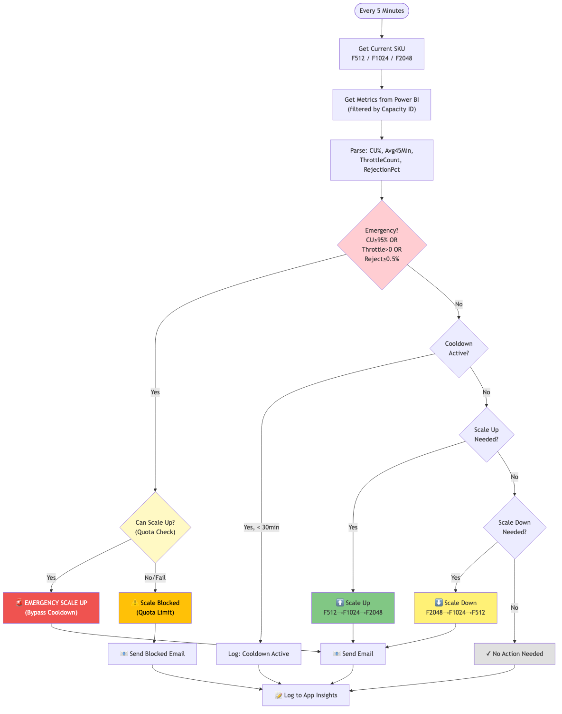
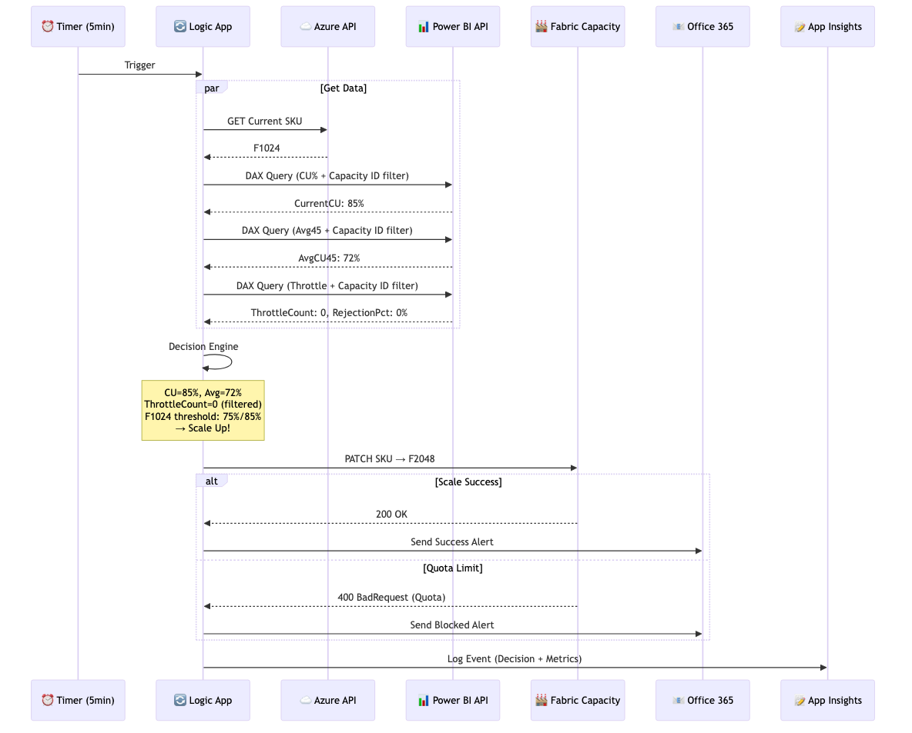

# Fabric Auto-Scaling Architecture & Design

## Overview

Automated Microsoft Fabric capacity scaling solution using Azure Logic App that monitors utilization metrics and adjusts capacity SKU based on demand.

---

## Scaling Logic Flow



---

## Component Design

### Data Collection Layer

- **Azure REST API** - Get current SKU from Fabric Capacity
- **Power BI REST API** - Execute DAX queries against Capacity Metrics
- **Capacity Metrics Semantic Model** - Source for CU%, throttle, rejection data

### Decision Engine

- Evaluates metrics against thresholds
- Checks emergency conditions (CU >= 95%, (Throttle > 50 AND CU >= 50%), Reject >= 0.5%)
- Enforces 30-minute cooldown between scaling
- Determines scale up / scale down / no action

### Action Layer

- **Scale Capacity** - PATCH request to Azure Fabric API
- **Email Notification** - Office 365 connector
- **Audit Logging** - Application Insights custom events

---

## Component Interaction



---

## Permissions & Access Configuration

### Tenant Level (Power BI Admin Portal)

| Setting | Location | Value |
|---------|----------|-------|
| **Service principals can use Fabric APIs** | Tenant Settings → Developer settings | Enabled |
| **Security Group** | Specific security groups | Fabric-API-Service-Principals |

**Steps to Configure:**
```
1. Go to https://app.powerbi.com
2. Click Settings (gear) → Admin Portal
3. Go to "Tenant settings"
4. Scroll to "Developer settings"
5. Enable "Service principals can use Fabric APIs"
6. Add Logic App MSI to allowed security group
```

---

### Azure Subscription Level

| Permission | Role | Assigned To |
|------------|------|-------------|
| Read/Write Fabric Capacity | Contributor | Logic App MSI |

**Scope:**
```
/subscriptions/{subscription-id}/resourceGroups/{rg}/providers/Microsoft.Fabric/capacities/{capacity-name}
```

**CLI Command:**
```bash
az role assignment create \
  --assignee {MSI-OBJECT-ID} \
  --role "Contributor" \
  --scope "/subscriptions/.../providers/Microsoft.Fabric/capacities/{name}"
```

---

### Resource Group Level

| Resource | Role | Assigned To |
|----------|------|-------------|
| Logic App | System-Assigned MSI | Auto-created |
| Fabric Capacity | Contributor | Logic App MSI |
| Application Insights | (Inherited) | Logic App MSI |

---

### Power BI Workspace Level

| Permission | Role | Assigned To |
|------------|------|-------------|
| Execute DAX Queries | Contributor or Member | Logic App MSI |
| Read Semantic Model | Contributor or Member | Logic App MSI |

**Steps to Configure:**
```
1. Go to Power BI Service → Workspace
2. Click "..." → Manage access
3. Add Logic App MSI (search by Object ID)
4. Assign role: Contributor or Member
```

**Role Comparison:**

| Role | Can Execute DAX | Can Read Data | Can Modify |
|------|-----------------|---------------|------------|
| Viewer | No | Yes | No |
| Contributor | Yes | Yes | Yes |
| Member | Yes | Yes | Yes |
| Admin | Yes | Yes | Yes |

---

### Managed Service Identity (MSI)

| Property | Value |
|----------|-------|
| **Type** | System-Assigned |
| **Object ID** | `2ed1544b-1f12-4c2f-970a-d4719e30c504` |
| **Tenant ID** | `8ce6dfd4-5866-4fdb-90d0-fb4a65d44617` |

**API Audiences:**

| API | Audience |
|-----|----------|
| Azure Management | `https://management.azure.com` (default) |
| Power BI | `https://analysis.windows.net/powerbi/api` |

---

## DAX Query Design

### Query Strategy

| Query | Table | Filter | Purpose |
|-------|-------|--------|---------|
| Current CU | `Usage Summary (Last 1 hour)` | Capacity ID | Get latest CU% |
| 45-Min Avg | `Usage Summary (Last 1 hour)` | Capacity ID + Time | Get rolling average |
| Throttle | `Items Throttled` | Capacity ID + Time | Count throttled items |
| Rejection | `CU Detail` | Latest record | Get rejection % |

**Important:**
- `Items Throttled` HAS `[Capacity Id]` column - MUST filter
- `CU Detail` does NOT have `[Capacity Id]` - cannot filter

---

## Error Handling Design

### Graceful Failure Pattern

```
┌─────────────────────────────────────────┐
│  Scope: Emergency_Scale_Scope           │
│  ├── HTTP: Scale to F2048               │
│  └── (may fail due to quota)            │
└─────────────────────────────────────────┘
                    │
                    ▼
┌─────────────────────────────────────────┐
│  Check: result('Scope')[0]['status']    │
│  ├── Succeeded → Send Success Email     │
│  └── Failed → Send Blocked Email        │
└─────────────────────────────────────────┘
```

### Common Errors

| Error | Cause | Resolution |
|-------|-------|------------|
| 401 Unauthorized | MSI not in workspace | Add MSI as Contributor |
| 403 Forbidden | Missing Contributor role | Assign role on capacity |
| 400 BadRequest | Quota limit reached | Request quota increase |
| DAXQueryFailure | Bad syntax | Test in DAX Studio |

---

## Logic App Action Flow


---

## Deployment Structure

```
Azure Subscription
└── Resource Group: MHA-BI-PowerBI-Prod-RG
    ├── Logic App: fabric-autoscaling-logic
    │   ├── System-Assigned MSI
    │   ├── Office 365 API Connection
    │   └── Timer Trigger (5 min)
    │
    ├── Fabric Capacity: bifabricprdentreport01
    │   └── SKU: F512 / F1024 / F2048
    │
    └── Application Insights
        └── Custom Events: FabricAutoScale

Power BI Service
└── Workspace: (Capacity Metrics)
    └── Semantic Model: Microsoft Fabric Capacity Metrics
```

---

## Key Design Decisions

| Decision | Rationale |
|----------|-----------|
| 5-min interval | Balance responsiveness vs API cost |
| 45-min average | Smooth spikes, prevent oscillation |
| 30-min cooldown | Allow metrics to stabilize |
| Emergency bypass | Immediate response to critical load |
| Capacity ID filter | Isolate target capacity metrics |
| Scope pattern | Graceful quota failure handling |
| MSI auth | No secrets, auto-rotation |

---

*Document Version: 1.0*
*Last Updated: 2026-01-05*
