# Microsoft Fabric Capacity Auto-Scaling

[](https://azure.microsoft.com/services/logic-apps/)
[](https://www.microsoft.com/microsoft-fabric)
[](https://opensource.org/licenses/MIT)

An enterprise-grade Azure Logic App solution for **automatic scaling** of Microsoft Fabric capacity based on real-time metrics, throttling detection, and rejection rate monitoring.

---

## Table of Contents

- [Overview](#overview)
- [Use Cases](#use-cases)
- [Architecture](#architecture)
- [Features](#features)
- [Scaling Logic](#scaling-logic)
- [Prerequisites](#prerequisites)
- [Required Permissions](#required-permissions)
- [Installation](#installation)
- [Configuration](#configuration)
- [Monitoring](#monitoring)
- [Troubleshooting](#troubleshooting)
- [Cost Optimization](#cost-optimization)
- [FAQ](#faq)
- [Contributing](#contributing)
- [License](#license)

---

## Overview

Microsoft Fabric charges based on Capacity Units (CUs). When your workload exceeds capacity, users experience:
- **Throttling** - Queries are delayed or rejected
- **Poor Performance** - Long wait times for reports and data processing
- **Failed Jobs** - Background operations may fail

This solution **automatically scales your Fabric capacity** up or down based on real-time usage patterns, preventing throttling while optimizing costs.

---

## Use Cases

### 1. Unpredictable Workloads
> "Our BI reports have unpredictable peak times depending on business events"

The auto-scaler monitors real-time CU utilization and scales up before throttling occurs.

### 2. Cost Optimization
> "We're paying for F2048 24/7 but only need it during business hours"

Automatically scales down to F512/F1024 during low-usage periods, reducing costs by up to 75%.

### 3. ETL/Data Pipeline Protection
> "Our nightly data pipelines sometimes fail due to capacity issues"

Emergency scaling detects throttling instantly and scales up to protect critical jobs.

### 4. Multi-Region Deployments
> "We have users across different time zones with varying peak hours"

Deploy multiple instances with region-specific configurations for optimal coverage.

### 5. Compliance & Audit
> "We need to track all capacity changes for cost allocation"

Complete audit trail in Application Insights with detailed metrics and timestamps.

---

## Architecture

> See [architecture-diagrams.md](architecture-diagrams.md) for additional diagrams.

### Scaling Logic Flow

```mermaid
flowchart TD
    Start(["Every 5 Minutes"]) --> GetSKU["Get Current SKU<br/>F512 / F1024 / F2048"]
    GetSKU --> GetMetrics["Get Metrics from Power BI<br/>(filtered by Capacity ID)"]
    GetMetrics --> ParseMetrics["Parse: CU%, Avg45Min,<br/>ThrottleCount, RejectionPct"]
    ParseMetrics --> Emergency{"Emergency?<br/>CU≥95% OR<br/>Throttle>0 OR<br/>Reject≥0.5%"}

    Emergency -->|Yes| CheckQuota{"Can Scale Up?<br/>(Quota Check)"}
    CheckQuota -->|Yes| EmergencyScale["🚨 EMERGENCY SCALE UP<br/>(Bypass Cooldown)"]
    CheckQuota -->|No/Fail| QuotaBlocked["⚠️ Scale Blocked<br/>(Quota Limit)"]
    Emergency -->|No| Cooldown{"Cooldown<br/>Active?"}

    Cooldown -->|Yes, < 30min| LogCooldown["Log: Cooldown Active"]
    Cooldown -->|No| CheckScaleUp{"Scale Up<br/>Needed?"}

    CheckScaleUp -->|Yes| ScaleUp["⬆️ Scale Up<br/>F512→F1024→F2048"]
    CheckScaleUp -->|No| CheckScaleDown{"Scale Down<br/>Needed?"}

    CheckScaleDown -->|Yes| ScaleDown["⬇️ Scale Down<br/>F2048→F1024→F512"]
    CheckScaleDown -->|No| NoAction["✓ No Action Needed"]

    EmergencyScale --> Notify["📧 Send Email"]
    QuotaBlocked --> NotifyBlocked["📧 Send Blocked Email"]
    ScaleUp --> Notify
    ScaleDown --> Notify
    LogCooldown --> Log["📝 Log to App Insights"]
    NoAction --> Log
    Notify --> Log
    NotifyBlocked --> Log

    style Emergency fill:#ffcdd2
    style EmergencyScale fill:#ef5350,color:#fff
    style QuotaBlocked fill:#ffc107,color:#000
    style CheckQuota fill:#fff9c4
    style ScaleUp fill:#81c784
    style ScaleDown fill:#fff176
    style NoAction fill:#e0e0e0
```



### Component Interaction

```mermaid
sequenceDiagram
    participant Timer as ⏰ Timer (5min)
    participant LA as 🔄 Logic App
    participant Azure as ☁️ Azure API
    participant PBI as 📊 Power BI API
    participant Fabric as 🏭 Fabric Capacity
    participant Email as 📧 Office 365
    participant AI as 📝 App Insights

    Timer->>LA: Trigger

    par Get Data
        LA->>Azure: GET Current SKU
        Azure-->>LA: F1024
        LA->>PBI: DAX Query (CU% + Capacity ID filter)
        PBI-->>LA: CurrentCU: 85%
        LA->>PBI: DAX Query (Avg45 + Capacity ID filter)
        PBI-->>LA: AvgCU45: 72%
        LA->>PBI: DAX Query (Throttle + Capacity ID filter)
        PBI-->>LA: ThrottleCount: 0, RejectionPct: 0%
    end

    LA->>LA: Decision Engine
    Note over LA: CU=85%, Avg=72%<br/>ThrottleCount=0 (filtered)<br/>F1024 threshold: 75%/85%<br/>→ Scale Up!

    LA->>Fabric: PATCH SKU → F2048
    alt Scale Success
        Fabric-->>LA: 200 OK
        LA->>Email: Send Success Alert
    else Quota Limit
        Fabric-->>LA: 400 BadRequest (Quota)
        LA->>Email: Send Blocked Alert
    end

    LA->>AI: Log Event (Decision + Metrics)
```



---

## Features

| Feature | Description |
|---------|-------------|
| **Real-time CU Monitoring** | Monitors current and 45-minute average CU utilization |
| **Throttle Detection** | Automatically scales up when throttling is detected (last 15 minutes) |
| **Rejection Rate Monitoring** | Scales up when interactive rejection % exceeds 0.5% |
| **Emergency Scaling** | Immediate scale-up when CU >= 95% (bypasses cooldown) |
| **Smart Cooldown** | 30-minute cooldown prevents rapid scaling oscillation |
| **Email Notifications** | HTML-formatted alerts for all scaling events |
| **Application Insights Logging** | Complete audit trail of all decisions |
| **Gulf Time Support** | Timestamps in UTC+4 for Middle East deployments |

---

## Scaling Logic

### Supported SKU Tiers

| SKU | CU Capacity | Scale Up Trigger | Scale Down Trigger |
|-----|-------------|------------------|-------------------|
| **F512** | 512 CUs | Avg ≥ 60% AND Current ≥ 70% | *(minimum tier)* |
| **F1024** | 1024 CUs | Avg ≥ 75% AND Current ≥ 85% | Avg ≤ 25% AND Current ≤ 40% |
| **F2048** | 2048 CUs | *(maximum tier)* | Avg ≤ 50% AND Current ≤ 60% |

### Emergency Triggers (Bypass Cooldown)

Scale-up is triggered **immediately** when ANY of these conditions are met:

| Condition | Threshold | Why |
|-----------|-----------|-----|
| **High CU** | Current CU ≥ 95% | Critical load, near capacity limit |
| **Throttling** | ThrottleCount > 0 | Users experiencing delays |
| **Rejections** | RejectionPct ≥ 0.5% | Queries being rejected |

### Cooldown Rules

| Scenario | Cooldown |
|----------|----------|
| Normal Scale-Up | 30 minutes |
| Normal Scale-Down | 30 minutes |
| Emergency Scale-Up | **No cooldown** (immediate) |

---

## Prerequisites

| Requirement | Description |
|-------------|-------------|
| **Azure Subscription** | Active subscription with billing enabled |
| **Microsoft Fabric Capacity** | F512, F1024, or F2048 SKU provisioned |
| **Fabric Capacity Metrics App** | Installed in a Power BI workspace ([Install Guide](https://learn.microsoft.com/fabric/enterprise/metrics-app)) |
| **Azure Logic App** | Standard or Consumption tier with Managed Identity |
| **Office 365 Connection** | For email notifications (or modify for other providers) |
| **Application Insights** | For logging and monitoring |

---

## Required Permissions

### 1. Logic App Managed Identity Permissions

The Logic App uses a **System-Assigned Managed Identity** to authenticate. Grant the following:

#### a) Fabric Capacity - Contributor Role

```bash
# Get the Logic App's Managed Identity Object ID
az logic workflow show \
  --resource-group <RESOURCE_GROUP> \
  --name <LOGIC_APP_NAME> \
  --query identity.principalId -o tsv

# Assign Contributor role on Fabric Capacity
az role assignment create \
  --assignee <MANAGED_IDENTITY_OBJECT_ID> \
  --role "Contributor" \
  --scope "/subscriptions/<SUBSCRIPTION_ID>/resourceGroups/<RESOURCE_GROUP>/providers/Microsoft.Fabric/capacities/<CAPACITY_NAME>"
```

#### b) Power BI API Access

The Managed Identity needs access to execute DAX queries against the Capacity Metrics semantic model:

1. Go to **Power BI Admin Portal** → **Tenant Settings**
2. Enable **"Service principals can use Fabric APIs"**
3. Add the Managed Identity to an allowed security group (or allow all)
4. In the **Power BI Workspace** containing Capacity Metrics:
   - Go to **Access** → **Add people or groups**
   - Add the Managed Identity as **Contributor** or **Member**

### 2. Office 365 API Connection

The Logic App needs an Office 365 API connection for email notifications:

1. In the Logic App designer, add an Office 365 Outlook action
2. Authenticate with a mailbox that can send notifications
3. Grant the connection **"Send mail as shared"** if using a shared mailbox

### 3. Application Insights

Create or use an existing Application Insights instance:

```bash
# Create Application Insights
az monitor app-insights component create \
  --app <APP_INSIGHTS_NAME> \
  --location <LOCATION> \
  --resource-group <RESOURCE_GROUP> \
  --application-type web

# Get Instrumentation Key
az monitor app-insights component show \
  --app <APP_INSIGHTS_NAME> \
  --resource-group <RESOURCE_GROUP> \
  --query instrumentationKey -o tsv
```

### Permission Summary Table

| Resource | Identity | Role/Permission | Purpose |
|----------|----------|-----------------|---------|
| Fabric Capacity | Logic App MSI | Contributor | Read/Update SKU |
| Power BI Workspace | Logic App MSI | Contributor | Execute DAX queries |
| Power BI Tenant | Logic App MSI | Service Principal API Access | API authentication |
| Office 365 | User/Shared Mailbox | Send Mail | Email notifications |
| Application Insights | Logic App MSI | Monitoring Metrics Publisher | Log events |

---

## Installation

### Step 1: Clone Repository

```bash
git clone https://github.com/Abhishek-Kraj/fabric-capacity-autoscaling.git
cd fabric-capacity-autoscaling
```

### Step 2: Create Logic App (if not exists)

```bash
az logic workflow create \
  --resource-group <RESOURCE_GROUP> \
  --name <LOGIC_APP_NAME> \
  --location <LOCATION> \
  --state Enabled \
  --definition @workflow.json
```

### Step 3: Enable Managed Identity

```bash
az logic workflow update \
  --resource-group <RESOURCE_GROUP> \
  --name <LOGIC_APP_NAME> \
  --set identity.type=SystemAssigned
```

### Step 4: Configure Parameters

Copy `parameters.template.json` and fill in your values:

```bash
cp parameters.template.json parameters.json
# Edit parameters.json with your values
```

### Step 5: Deploy Workflow

```bash
./deploy.sh
# Or manually:
az logic workflow update \
  --resource-group <RESOURCE_GROUP> \
  --name <LOGIC_APP_NAME> \
  --definition @workflow.json
```

### Step 6: Grant Permissions

Follow the [Required Permissions](#required-permissions) section to grant all necessary access.

### Step 7: Create Office 365 Connection

In the Azure Portal:
1. Navigate to the Logic App
2. Click **API Connections**
3. Create a new **Office 365 Outlook** connection
4. Authenticate and authorize

### Step 8: Test the Workflow

```bash
# Trigger a manual run
az logic workflow trigger \
  --resource-group <RESOURCE_GROUP> \
  --name <LOGIC_APP_NAME> \
  --trigger-name Recurrence
```

---

## Configuration

### Parameters Reference

| Parameter | Description | Example |
|-----------|-------------|---------|
| `capacitySubscriptionId` | Azure subscription ID containing Fabric capacity | `12345678-1234-1234-1234-123456789abc` |
| `capacityResourceGroup` | Resource group name | `rg-fabric-prod` |
| `capacityName` | Fabric capacity name | `fabriccapacity01` |
| `powerBIWorkspaceId` | Power BI workspace ID with Capacity Metrics app | `87654321-4321-4321-4321-cba987654321` |
| `powerBIDatasetId` | Capacity Metrics semantic model ID | `abcdef12-3456-7890-abcd-ef1234567890` |
| `appInsightsInstrumentationKey` | Application Insights instrumentation key | `11111111-2222-3333-4444-555555555555` |
| `notificationEmail` | Email address for scaling alerts | `team@company.com` |
| `capacityId` | Fabric capacity GUID (for DAX queries) | `aaaabbbb-cccc-dddd-eeee-ffff00001111` |

### Finding Your IDs

#### 1. Capacity Subscription ID

**Via Azure Portal:**
```
Azure Portal → Subscriptions → Select your subscription → Overview
Copy the "Subscription ID"
```

**Via Azure CLI:**
```bash
az account show --query id -o tsv
```

---

#### 2. Capacity Resource Group & Capacity Name

**Via Azure Portal:**
```
Azure Portal → Microsoft Fabric → Capacities → Select your capacity
├── Resource Group: shown in "Essentials" section
└── Capacity Name: shown at the top (e.g., "fabriccapacity01")
```

**Via Azure CLI:**
```bash
# List all Fabric capacities
az resource list --resource-type "Microsoft.Fabric/capacities" --query "[].{name:name, resourceGroup:resourceGroup}" -o table
```

---

#### 3. Capacity ID (GUID for DAX queries)

**Via Azure Portal:**
```
Azure Portal → Microsoft Fabric → Capacities → Select your capacity → Properties
Copy the "Capacity ID" (GUID format: aaaabbbb-cccc-dddd-eeee-ffff00001111)
```

**Via Azure CLI:**
```bash
az rest --method GET \
  --uri "https://management.azure.com/subscriptions/<SUBSCRIPTION_ID>/resourceGroups/<RESOURCE_GROUP>/providers/Microsoft.Fabric/capacities/<CAPACITY_NAME>?api-version=2023-11-01" \
  --query "properties.capacityId" -o tsv
```

**Via Power BI:**
```
Power BI Service → Settings (gear icon) → Admin Portal → Capacity settings
Select your capacity → The URL contains the capacity ID
Example: https://app.powerbi.com/admin-portal/capacities/aaaabbbb-cccc-dddd-eeee-ffff00001111
```

---

#### 4. Power BI Workspace ID

**Via Power BI Service (Easiest):**
```
1. Go to https://app.powerbi.com
2. Navigate to your workspace (where Capacity Metrics app is installed)
3. Look at the URL in your browser:
   https://app.powerbi.com/groups/87654321-4321-4321-4321-cba987654321/list
                                 ^^^^^^^^^^^^^^^^^^^^^^^^^^^^^^^^^^^^
                                 This is your Workspace ID
```

**Via Power BI REST API:**
```bash
# First get an access token
TOKEN=$(az account get-access-token --resource https://analysis.windows.net/powerbi/api --query accessToken -o tsv)

# List all workspaces
curl -s -H "Authorization: Bearer $TOKEN" \
  "https://api.powerbi.com/v1.0/myorg/groups" | jq '.value[] | {name, id}'
```

---

#### 5. Power BI Semantic Model ID (Capacity Metrics Semantic Model)

**Via Power BI Service (Easiest):**
```
1. Go to https://app.powerbi.com
2. Navigate to the workspace with Capacity Metrics
3. Click on the "Microsoft Fabric Capacity Metrics" semantic model
   Note: Name may vary (e.g., "Fabric Capacity Metrics", "Capacity Metrics")
4. Look at the URL:
   https://app.powerbi.com/groups/87654321.../datasets/abcdef12-3456-7890-abcd-ef1234567890/details
                                                       ^^^^^^^^^^^^^^^^^^^^^^^^^^^^^^^^^^^^
                                                       This is your Semantic Model (Dataset) ID
```

**Via Power BI REST API:**
```bash
TOKEN=$(az account get-access-token --resource https://analysis.windows.net/powerbi/api --query accessToken -o tsv)

# List semantic models in workspace (API still uses 'datasets')
curl -s -H "Authorization: Bearer $TOKEN" \
  "https://api.powerbi.com/v1.0/myorg/groups/<WORKSPACE_ID>/datasets" | jq '.value[] | {name, id}'
```

**Expected Output:**
```json
{
  "name": "Microsoft Fabric Capacity Metrics",
  "id": "abcdef12-3456-7890-abcd-ef1234567890"
}
```

> **Note:** The semantic model name may appear as "Fabric Capacity Metrics", "Microsoft Fabric Capacity Metrics", or a custom name if renamed by your organization.

---

#### 6. Application Insights Instrumentation Key

**Via Azure Portal:**
```
Azure Portal → Application Insights → Select your instance → Overview
Copy the "Instrumentation Key" (shown in Essentials section)
```

**Via Azure CLI:**
```bash
az monitor app-insights component show \
  --app <APP_INSIGHTS_NAME> \
  --resource-group <RESOURCE_GROUP> \
  --query instrumentationKey -o tsv
```

---

### Power BI Tenant Settings (Admin Portal)

These settings must be configured by a **Power BI Admin** for the Logic App's Managed Identity to work.

#### Step 1: Enable Service Principal API Access

```
1. Go to https://app.powerbi.com
2. Click Settings (gear icon) → Admin Portal
3. Go to "Tenant settings" in the left menu
4. Scroll to "Developer settings" section
5. Find "Service principals can use Fabric APIs"
6. Enable it and choose one of:
   ├── "The entire organization" (allows all service principals)
   └── "Specific security groups" (recommended - create a group first)
```

**If using Specific Security Groups:**
```
1. Go to Azure Portal → Entra ID (Azure AD) → Groups
2. Create a new Security Group (e.g., "Fabric-API-Service-Principals")
3. Add the Logic App's Managed Identity as a member:
   - Go to Logic App → Identity → Copy Object (principal) ID
   - In the Security Group → Members → Add → Paste the Object ID
4. Back in Power BI Admin Portal, add this group to the setting
```

---

#### Step 2: Add Managed Identity to Power BI Workspace

```
1. Go to Power BI Service → Your Workspace (with Capacity Metrics)
2. Click "..." (more options) → "Manage access" (or "Access")
3. Click "Add people or groups"
4. Search for the Logic App name (it shows as an "App" icon)
   - If not found, search by Object ID from Azure
5. Assign role: "Contributor" or "Member"
6. Click "Add"
```

**Workspace Role Permissions:**

| Role | Can Execute DAX | Can Read Semantic Model | Can Modify |
|------|-----------------|------------------|------------|
| Viewer | No | Yes | No |
| Contributor | Yes | Yes | Yes |
| Member | Yes | Yes | Yes |
| Admin | Yes | Yes | Yes |

---

### Azure Resource Permissions

#### Fabric Capacity - Contributor Role

The Logic App needs **Contributor** role on the Fabric Capacity to change SKU.

**Via Azure Portal:**
```
1. Azure Portal → Microsoft Fabric → Capacities → Your Capacity
2. Click "Access control (IAM)" in left menu
3. Click "Add" → "Add role assignment"
4. Role: "Contributor"
5. Members: Select "Managed identity" → "Logic app" → Your Logic App
6. Review + Assign
```

**Via Azure CLI:**
```bash
# Get Logic App's Managed Identity Object ID
OBJECT_ID=$(az logic workflow show \
  --resource-group <RESOURCE_GROUP> \
  --name <LOGIC_APP_NAME> \
  --query identity.principalId -o tsv)

# Assign Contributor role
az role assignment create \
  --assignee $OBJECT_ID \
  --role "Contributor" \
  --scope "/subscriptions/<SUBSCRIPTION_ID>/resourceGroups/<RESOURCE_GROUP>/providers/Microsoft.Fabric/capacities/<CAPACITY_NAME>"
```

---

### Quick Reference: All IDs Summary

| Parameter | Where to Find | Format |
|-----------|---------------|--------|
| `capacitySubscriptionId` | Azure Portal → Subscriptions | `12345678-1234-1234-1234-123456789abc` |
| `capacityResourceGroup` | Azure Portal → Fabric Capacity → Overview | `rg-fabric-prod` |
| `capacityName` | Azure Portal → Fabric Capacity → Overview | `fabriccapacity01` |
| `capacityId` | Azure Portal → Fabric Capacity → Properties | `aaaabbbb-cccc-dddd-eeee-ffff00001111` |
| `powerBIWorkspaceId` | Power BI URL after `/groups/` | `87654321-4321-4321-4321-cba987654321` |
| `powerBIDatasetId` | Power BI URL after `/datasets/` | `abcdef12-3456-7890-abcd-ef1234567890` |
| `appInsightsInstrumentationKey` | Azure Portal → App Insights → Overview | `11111111-2222-3333-4444-555555555555` |
| `notificationEmail` | Your email for alerts | `team@company.com` |

---

## Monitoring

### Application Insights Queries

See [kql-queries.md](kql-queries.md) for comprehensive KQL queries including:

- Recent scaling decisions
- Scaling events only (actual changes)
- CU trend over time
- Cooldown events
- SKU distribution
- Emergency scale events
- High CU alerts
- Daily scaling summary
- Average CU by hour of day
- Cost analysis (time at each SKU)

### Key Metrics Logged

| Metric | Description |
|--------|-------------|
| `Decision` | ScaleUp_F512_to_F1024, ScaleDown_F2048_to_F1024, NoAction, Cooldown, EMERGENCY_* |
| `CurrentSKU` | Current SKU tier (F512, F1024, F2048) |
| `CurrentCU` | Current CU utilization percentage |
| `AvgCU45Min` | 45-minute average CU percentage |
| `ThrottleCount` | Number of throttled items in last 15 minutes |
| `RejectionPct` | Interactive rejection percentage |
| `GulfTime` | Timestamp in UTC+4 |

### Sample Dashboard Query

```kql
customEvents
| where name == "FabricAutoScale"
| where timestamp > ago(24h)
| extend Decision = tostring(customDimensions.Decision),
         CurrentCU = todouble(customDimensions.CurrentCU)
| summarize ScaleUps = countif(Decision startswith "Scale" or Decision startswith "EMERGENCY"),
            AvgCU = avg(CurrentCU),
            MaxCU = max(CurrentCU)
  by bin(timestamp, 1h)
| render timechart
```

---

## Troubleshooting

### Common Errors We Encountered

#### 1. Power BI API - "Unauthorized" (401)

```json
{
  "error": {
    "code": "PowerBIEntityNotFound",
    "message": "Dataset not found"
  }
}
```

**Cause:** MSI not added to Power BI workspace OR tenant setting not enabled

**Solution:**
1. Enable "Service principals can use Fabric APIs" in Power BI Admin Portal → Tenant Settings
2. Add Logic App's MSI to the workspace as **Contributor** (not Viewer!)
3. Wait 5-10 minutes for permissions to propagate

---

#### 2. Capacity API - "Forbidden" (403)

```json
{
  "error": {
    "code": "AuthorizationFailed",
    "message": "does not have authorization to perform action 'Microsoft.Fabric/capacities/write'"
  }
}
```

**Cause:** MSI doesn't have Contributor role on Fabric Capacity

**Solution:**
```bash
# Get MSI Object ID
OBJECT_ID=$(az logic workflow show --resource-group <RG> --name <LA> --query identity.principalId -o tsv)

# Assign Contributor role
az role assignment create --assignee $OBJECT_ID --role "Contributor" \
  --scope "/subscriptions/<SUB>/resourceGroups/<RG>/providers/Microsoft.Fabric/capacities/<CAPACITY>"
```

---

#### 3. Deployment - Parameters Missing/Wiped

**Symptom:** After deploying with `az logic workflow update --definition`, all parameters become null

**Cause:** Using `--definition` only updates definition, not parameters

**Solution:** Use full PUT request with both definition AND parameters:
```bash
curl -X PUT \
  "https://management.azure.com/subscriptions/<SUB>/resourceGroups/<RG>/providers/Microsoft.Logic/workflows/<LA>?api-version=2016-06-01" \
  -H "Authorization: Bearer $(az account get-access-token --query accessToken -o tsv)" \
  -H "Content-Type: application/json" \
  -d '{
    "location": "westeurope",
    "properties": {
      "definition": { ... },
      "parameters": {
        "capacitySubscriptionId": {"value": "..."},
        "powerBIDatasetId": {"value": "..."},
        ...
      }
    }
  }'
```

---

#### 4. DAX Query - Syntax Error

```json
{
  "error": {
    "code": "DAXQueryFailure",
    "message": "The expression contains multiple columns"
  }
}
```

**Cause:** Invalid DAX syntax

**Solution:** Test DAX queries in Power BI Desktop first:
1. Open Power BI Desktop → Connect to dataset
2. View → DAX Studio (or use Performance Analyzer)
3. Test query before adding to Logic App

---

#### 5. MSI Not Found in Power BI Workspace Search

**Symptom:** Can't find Logic App when adding to workspace access

**Cause:** Search requires exact name or Object ID

**Solution:**
1. Get Object ID: `az logic workflow show --resource-group <RG> --name <LA> --query identity.principalId -o tsv`
2. In Power BI workspace → Access → paste the Object ID directly

---

#### 6. "BadRequest" - Invalid SKU

```json
{
  "error": {
    "code": "BadRequest",
    "message": "The SKU 'F2048' is not available for capacity"
  }
}
```

**Cause:** SKU not available in region OR quota limit reached

**Solution:**
1. Check regional availability: Azure Portal → Microsoft Fabric → Capacities → Pricing
2. Request quota increase if needed

---

#### 7. ThrottleCount Always High (Emergency Always Triggers)

**Symptom:** Emergency scale triggers every run even when CU is low. ThrottleCount shows high values (100+) in App Insights logs.

**Cause:** The `'Items Throttled'` table in Capacity Metrics contains data for ALL capacities, not just your target capacity. Without filtering by Capacity ID, the DAX query returns cumulative throttle counts.

**Solution:** Add Capacity ID filter to the DAX query:

```dax
-- Before (wrong - returns all capacities):
VAR ThrottleData = FILTER('Items Throttled',
    'Items Throttled'[Timestamp] >= NOW() - 5/1440)

-- After (correct - filters by your capacity):
VAR ThrottleData = FILTER('Items Throttled',
    'Items Throttled'[Timestamp] >= NOW() - 5/1440
    && 'Items Throttled'[Capacity Id] = "YOUR-CAPACITY-ID-HERE")
```

**Important Notes:**
- `'Items Throttled'` table HAS a `[Capacity Id]` column - use it!
- `'CU Detail'` table does NOT have `[Capacity Id]` - don't filter it
- Get your Capacity ID from Azure Portal → Fabric Capacity → Properties

---

### Error Summary Table

| Error Code | API | Cause | Fix |
|------------|-----|-------|-----|
| 401 Unauthorized | Power BI | MSI not in workspace | Add MSI as Contributor |
| 403 Forbidden | Fabric | Missing Contributor role | Assign role via Azure CLI |
| 400 BadRequest | Fabric | Invalid SKU/quota | Check availability |
| DAXQueryFailure | Power BI | Bad DAX syntax | Test in Power BI Desktop |
| Parameters null | Logic App | Wrong deployment method | Use PUT with full body |
| ThrottleCount always high | Power BI | Missing Capacity ID filter | Add `[Capacity Id]` filter to DAX |
| Emergency always triggers | Logic App | ThrottleCount > 0 from all capacities | Filter 'Items Throttled' by Capacity ID |

---

### Debug Mode

Add this to check raw API responses:

```json
"Compose_Debug": {
  "type": "Compose",
  "inputs": "@body('Get_Current_CU')",
  "runAfter": {"Get_Current_CU": ["Succeeded"]}
}
```

### Check Logic App Run History

```bash
# View recent runs
az logic workflow run list \
  --resource-group <RESOURCE_GROUP> \
  --name <LOGIC_APP_NAME> \
  --query "[0:5].{name:name, status:status, startTime:startTime}"

# View specific run details
az logic workflow run show \
  --resource-group <RESOURCE_GROUP> \
  --name <LOGIC_APP_NAME> \
  --name <RUN_NAME>
```

### View Failed Action Details

```bash
# List actions in a failed run
az logic workflow run action list \
  --resource-group <RESOURCE_GROUP> \
  --workflow-name <LOGIC_APP_NAME> \
  --run-name <RUN_NAME> \
  --filter "status eq 'Failed'"
```

---

## Cost Optimization

### Estimated Savings

| Scenario | Before | After | Monthly Savings |
|----------|--------|-------|-----------------|
| 24/7 F2048 → Scale down nights/weekends | $X/month | $0.6X/month | ~40% |
| Peak-only F2048 → F512 baseline | $X/month | $0.4X/month | ~60% |

### Time at Each SKU Analysis

```kql
customEvents
| where name == "FabricAutoScale"
| where timestamp > ago(30d)
| extend CurrentSKU = tostring(customDimensions.CurrentSKU)
| summarize Minutes = count() * 5 by CurrentSKU
| extend Hours = Minutes / 60.0
| extend EstimatedCost = Hours * case(
    CurrentSKU == "F512", 0.36,
    CurrentSKU == "F1024", 0.72,
    CurrentSKU == "F2048", 1.44,
    0.0
  )
| project CurrentSKU, Hours, EstimatedCost
```

---

## FAQ

**Q: Can I add more SKU tiers (F64, F128, etc.)?**
> Yes! Add new cases in the Switch statements for each scaling direction.

**Q: What happens if the Logic App fails?**
> The next run (5 minutes later) will retry. Critical failures are logged to Application Insights.

**Q: Can I change the 5-minute interval?**
> Yes, modify the Recurrence trigger. Minimum recommended: 3 minutes (due to metric refresh rates).

**Q: Does this work with Pay-As-You-Go Fabric?**
> Yes, but ensure your subscription has sufficient limits for higher SKUs.

**Q: Can I use Teams instead of email notifications?**
> Yes, replace the Office 365 action with a Teams webhook action.

---

## Contributing

Contributions are welcome! Please:

1. Fork the repository
2. Create a feature branch (`git checkout -b feature/amazing-feature`)
3. Commit your changes (`git commit -m 'Add amazing feature'`)
4. Push to the branch (`git push origin feature/amazing-feature`)
5. Open a Pull Request

---

## License

This project is licensed under the MIT License - see the [LICENSE](LICENSE) file for details.

---

## Author

**Abhishek Kumar**

---

## Acknowledgments

- Microsoft Fabric Documentation
- Azure Logic Apps Team
- Power BI REST API Documentation
