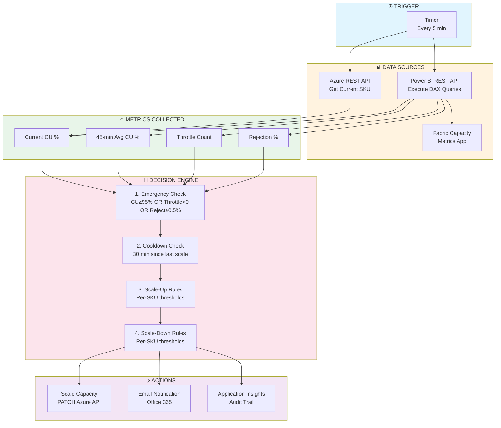
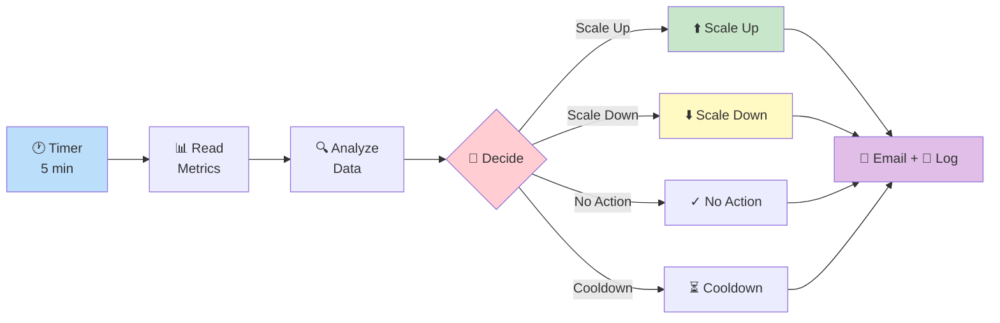

# Additional Architecture Diagrams

These are supplementary diagrams for those who want more detail.

## High-Level Architecture

```mermaid
flowchart TB
    subgraph trigger["⏰ TRIGGER"]
        Timer["Timer<br/>Every 5 min"]
    end

    subgraph datasources["📊 DATA SOURCES"]
        AzureAPI["Azure REST API<br/>Get Current SKU"]
        PowerBI["Power BI REST API<br/>Execute DAX Queries"]
        Metrics["Fabric Capacity<br/>Metrics App"]
    end

    subgraph collected["📈 METRICS COLLECTED"]
        M1["Current CU %"]
        M2["45-min Avg CU %"]
        M3["Throttle Count"]
        M4["Rejection %"]
    end

    subgraph decision["🧠 DECISION ENGINE"]
        E1["1. Emergency Check<br/>CU≥95% OR Throttle>0 OR Reject≥0.5%"]
        E2["2. Cooldown Check<br/>30 min since last scale"]
        E3["3. Scale-Up Rules<br/>Per-SKU thresholds"]
        E4["4. Scale-Down Rules<br/>Per-SKU thresholds"]
    end

    subgraph actions["⚡ ACTIONS"]
        Scale["Scale Capacity<br/>PATCH Azure API"]
        Email["Email Notification<br/>Office 365"]
        AppInsights["Application Insights<br/>Audit Trail"]
    end

    Timer --> AzureAPI
    Timer --> PowerBI
    PowerBI --> Metrics
    AzureAPI --> M1
    PowerBI --> M1
    PowerBI --> M2
    PowerBI --> M3
    PowerBI --> M4
    M1 --> E1
    M2 --> E1
    M3 --> E1
    M4 --> E1
    E1 --> E2
    E2 --> E3
    E3 --> E4
    E4 --> Scale
    E4 --> Email
    E4 --> AppInsights

    style trigger fill:#e1f5fe
    style datasources fill:#fff3e0
    style collected fill:#e8f5e9
    style decision fill:#fce4ec
    style actions fill:#f3e5f5
```

## Simple Decision Flow

```mermaid
flowchart LR
    A["🕐 Timer<br/>5 min"] --> B["📊 Read<br/>Metrics"]
    B --> C["🔍 Analyze<br/>Data"]
    C --> D{"🧠 Decide"}
    D -->|Scale Up| E["⬆️ Scale Up"]
    D -->|Scale Down| F["⬇️ Scale Down"]
    D -->|No Action| G["✓ No Action"]
    D -->|Cooldown| H["⏳ Cooldown"]
    E --> I["📧 Email + 📝 Log"]
    F --> I
    G --> I
    H --> I

    style A fill:#bbdefb
    style D fill:#ffcdd2
    style E fill:#c8e6c9
    style F fill:#fff9c4
    style I fill:#e1bee7
```
